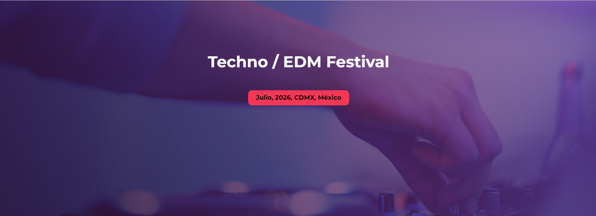
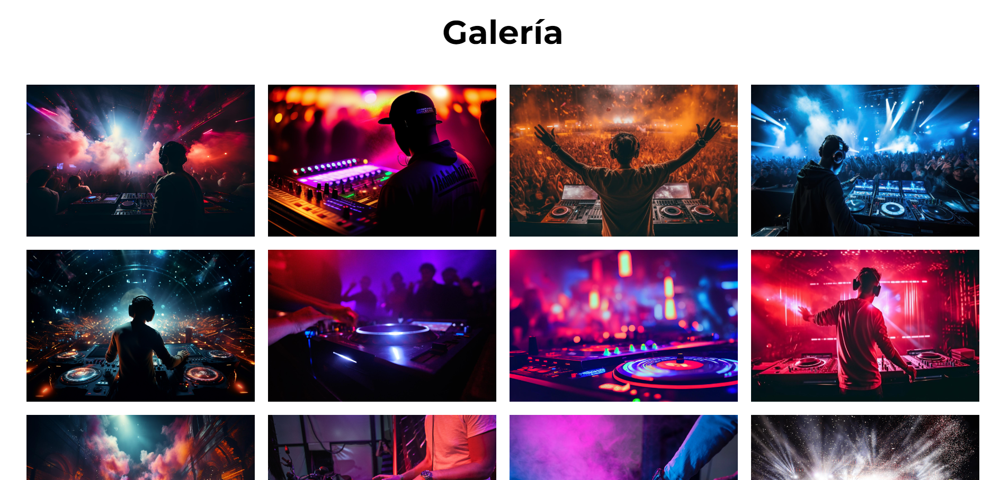

# Página del Festival de Música

[Ver el proyecto desplegado aquí](https://monumental-gecko-e81166.netlify.app/)

## Tabla de Contenidos

- [Descripción](#descripción)
- [Capturas de Pantalla](#capturas-de-pantalla)
- [Instalación](#instalación)
- [Uso](#uso)
- [Tecnologías Utilizadas](#tecnologías-utilizadas)
- [Autor](#autor)
- [Agradecimientos](#agradecimientos)

## Descripción

Este proyecto es una página web para un festival de música, desarrollada utilizando HTML, CSS, JavaScript, Sass y Gulp. El objetivo es proporcionar una experiencia de usuario atractiva y funcional, destacando los detalles del festival, como la programación, los artistas, la ubicación y la compra de entradas.

## Capturas de Pantalla

### Vista de Escritorio



## Instalación

Para instalar y ejecutar este proyecto localmente, sigue estos pasos:

1. Clona el repositorio
    ```bash
    git clone https://github.com/tu-usuario/tu-repositorio.git
    ```
2. Navega al directorio del proyecto
    ```bash
    cd tu-repositorio
    ```
3. Instala las dependencias
    ```bash
    npm install
    ```
4. Ejecuta Gulp para compilar Sass y lanzar un servidor local
    ```bash
    gulp
    ```
5. Abre `index.html` en tu navegador preferido

## Uso

Una vez que el servidor local esté en funcionamiento, podrás navegar por las diferentes secciones de la página del festival, explorar la programación, conocer a los artistas y obtener información sobre cómo llegar al evento. También podrás probar la funcionalidad responsive del diseño, que se adapta a dispositivos móviles, tablets y escritorio.

## Tecnologías Utilizadas

- HTML5
- CSS3
- JavaScript
- Sass
- Gulp

## Autor

- Portfolio - Fernando Vera (https://benevolent-frangipane-800c24.netlify.app/)
- Frontend Mentor - @FVeraCoding (https://www.frontendmentor.io/profile/FVeraCoding)
- GitHub - @FVeraCoding (https://github.com/FVeraCoding)

---
